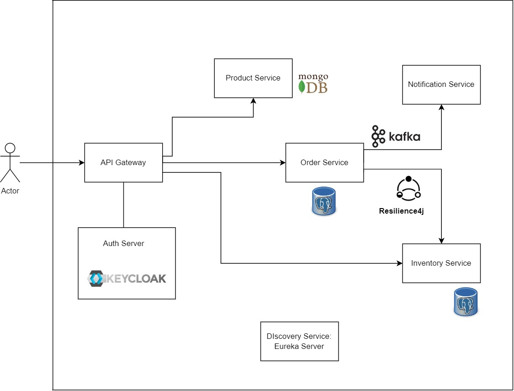

# Spring Boot Microservices

## Introduction

This project is an exploration of the Microservices Architecture by the simple online Shopping application. The project is composed of several independent components or services: an API Gateway, Product Service, Notification Service, Order Service, Inventory Service, and Discovery Service, each running in their environments and communicating with each other.

The main purpose of this project is not just to build a shop application, but to understand and get acquainted with the various patterns and dynamics of Microservices Architecture.

The next image illustrates the architecture of this Spring Boot based microservice application.

### How to run the application using Docker

Run `mvn clean package -DskipTests` to build the applications and create the docker image locally.

Run `docker-compose up -d` to start the applications.

Images of applications are available on my Docker Hub at https://hub.docker.com/u/pk12pk
